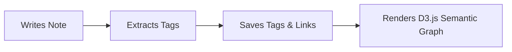

# 🌌 AetherNote: Comprehensive Implementation & Features Roadmap

Welcome to the development blueprint for **AetherNote**! This guide bridges the gap between your sleek landing page and a fully functioning, high-performance web application. 

Currently, your project has **Authentication completed** on both the frontend and backend, with a basic `notes` database migration and route resource ready. Below is your roadmap to building a highly interactive, animated, and challenging application.

---

## 🗺️ Project Architecture Overview

AetherNote uses a decoupled architecture for maximum speed and smooth interface transitions:
- **Frontend**: Next.js 16 (React 19), styled with TailwindCSS, animated with Framer Motion, using TypeScript for type safety, and Lucide React for iconography.
- **Backend**: Laravel 11 with Laravel Sanctum for API token authentication, PostgreSQL/MySQL for relational data, and Laravel Reverb for real-time WebSocket syncing.

---

## 🛠️ Step 1: Base Notes Architecture & Rich Editor
The foundation of any note-taking app is writing and viewing notes. We want to skip generic textareas and build a futuristic workspace.

### 1. Backend: Database Schema Extensions
Your current `notes` migration contains only `title` and `content`. To support spatial grids, tags, and syncing, we need to update our database structure.

**Action**: Create a migration to extend the `notes` table:
```bash
php artisan make:migration add_rich_fields_to_notes_table --table=notes
```

**Migration Fields**:
```php
Schema::table('notes', function (Blueprint $table) {
    // Spatial positioning for the Infinite Canvas
    $table->float('x_position')->default(0);
    $table->float('y_position')->default(0);
    
    // Customization
    $table->string('color', 7)->default('#1b1f2c'); // Hex code matching the surface-container style
    $table->boolean('is_pinned')->default(false);
    $table->timestamp('archived_at')->nullable();
    
    // Encryption metadata (if End-to-End Encryption is active)
    $table->string('encryption_iv')->nullable(); // Initialization Vector
});
```

### 2. Frontend: TipTap / Lexical WYSIWYG Editor
For a modern note-taking experience, we'll use **TipTap** (a headless wrapper around ProseMirror). It allows full styling flexibility and custom keyboard bindings (like Notion's `/` command menu).

**Installation**:
```bash
npm install @tiptap/react @tiptap/pm @tiptap/starter-kit
```

**Implementation Strategy**:
- Create a reusable editor component `components/editor/AetherEditor.tsx`.
- Wrap the editor inside a glassmorphic container (`backdrop-filter: blur(20px)`).
- On text changes, debounced-save the notes content (e.g., 800ms delay) to the Laravel backend via a `PUT /api/notes/{id}` API request.

---

## 🧠 Step 2: Neural Organization (AI Auto-Tagging & Graph View)
*This is the core differentiator of AetherNote.* When a user finishes writing, an AI service automatically extracts key concepts, tags the note, and draws a visual line connecting notes with similar themes.



### 1. Backend: Tags and Relationships Schema
We need a many-to-many relationship between Notes and Tags, and a self-referencing relationship for Note Links.

**Action**: Run migrations:
```bash
php artisan make:model Tag -m
php artisan make:migration create_note_tag_table
php artisan make:migration create_note_links_table
```

**Schema definitions**:
```php
// tags table migration
Schema::create('tags', function (Blueprint $table) {
    $table->id();
    $table->string('name')->unique();
    $table->string('slug')->unique();
    $table->timestamps();
});

// note_tag pivot table migration
Schema::create('note_tag', function (Blueprint $table) {
    $table->foreignId('note_id')->constrained()->cascadeOnDelete();
    $table->foreignId('tag_id')->constrained()->cascadeOnDelete();
    $table->primary(['note_id', 'tag_id']);
});

// note_links (semantic connection mapping) table migration
Schema::create('note_links', function (Blueprint $table) {
    $table->id();
    $table->foreignId('source_note_id')->constrained('notes')->cascadeOnDelete();
    $table->foreignId('target_note_id')->constrained('notes')->cascadeOnDelete();
    $table->float('similarity_score')->default(1.0); // Match strength
    $table->timestamps();
});
```

### 2. Backend: AI Extraction Service (Challenge #1)
When a note is created or updated, dispatch a queued background Job to analyze the content and dynamically associate tags.

**Implementation Logic (`app/Jobs/AnalyzeNoteSemanticRelations.php`)**:
- Send the note content to a LLM provider (Gemini API, OpenAI API, or a local Ollama server running Llama 3).
- **Prompt**: *"Analyze this note content. Return a JSON array of up to 5 relevant tags and identify if this note matches the conceptual themes of these existing notes: [List of user's notes with IDs and titles]. Output only JSON."*
- Sync the returned tags using `$note->tags()->sync(...)`.
- Insert entries into the `note_links` table for notes with high semantic overlap.

### 3. Frontend: Interactive D3.js Force-Directed Graph (Challenge #2)
Provide a visual dashboard showing notes as glowing nodes floating in space, connected by thin lines.

**Installation**:
```bash
npm install react-force-graph-2d
```

**Implementation Strategy**:
- Create `components/graph/NeuralGraph.tsx`.
- Fetch all note nodes and links from a new API endpoint: `GET /api/notes/graph`.
- Customize the canvas rendering:
  - Draw nodes as glowing spheres with color codes (`note.color`).
  - Render source-to-target links as thin electric blue lines with dynamic opacity depending on the `similarity_score`.
  - Add click interactions: Clicking a node zooms into that note and opens the editor.

---

## ⚡ Step 3: Instant search (<10ms) & Command Palette
Fast retrieval is crucial for a "Second Brain." We will combine local browser caching for fast search and database optimizations on the backend.

### 1. Frontend: The Kbar / Cmdk Palette
Use a global hotkey (e.g. `Cmd+K` or `Ctrl+K`) to trigger a beautiful floating modal.

**Installation**:
```bash
npm install cmdk
```

**Behavior**:
- On dashboard mount, fetch a lightweight list of all notes (only IDs, titles, and tags) and store it in memory.
- Use **Fuse.js** for client-side fuzzy searching:
  ```bash
  npm install fuse.js
  ```
- Instant search results are rendered in real-time as the user types, with keyboard arrow keys navigation and Framer Motion micro-animations.

### 2. Backend: Full-Text Search Indices
For fallback search (on larger datasets or searching within contents), add database full-text indices.

**Action**: Add index migration:
```php
Schema::table('notes', function (Blueprint $table) {
    $table->fullText(['title', 'content']);
});
```
**Controller Method**:
```php
public function search(Request $request) {
    $query = $request->get('q');
    return Note::whereFullText(['title', 'content'], $query)->get();
}
```

---

## 📐 Step 4: Infinite Canvas (Spatial Note Interface)
Combine mind mapping with standard notes. The workspace is a scalable, infinite grid where notes can be placed at absolute coordinate positions.

```
+-------------------------------------------------------+
|  Infinite Workspace (Grid Pattern CSS)                |
|                                                       |
|   [ Note Card A (X: 100, Y: 200) ]                    |
|          |                                            |
|          | (SVG Arrow line)                           |
|          v                                            |
|                  [ Note Card B (X: 450, Y: 180) ]     |
|                                                       |
+-------------------------------------------------------+
```

### 1. Frontend: Zoom, Pan & Drag Components
- **Pan and Zoom**: Wrap the canvas in a container that handles scale and translation states using CSS transform matrices (`transform: translate(x, y) scale(s)`).
- **Drag-and-Drop Cards**: Use `@use-gesture/react` or Framer Motion's `drag` feature:
  ```tsx
  <motion.div
    drag
    dragMomentum={false}
    x={note.x_position}
    y={note.y_position}
    onDragEnd={(event, info) => {
      // Send updated x and y positions to backend: PUT /api/notes/{id}
    }}
  />
  ```
- **SVG Connections**: Render an overlay `<svg>` element spanning the entire grid, drawing paths from the borders of connected notes using the coordinates stored in the `note_links` table.

---

## 🔒 Step 5: End-to-End Encryption (E2EE - Hard Challenge)
For users who require total privacy, we implement a Zero-Knowledge encryption model. The server never sees the raw content of the notes.

```
[Plain Note] ---> (Encrypt with user's key in browser) ---> [Ciphertext] ---> (Laravel Backend)
                                                                                  |
[Plain Note] <--- (Decrypt with user's key in browser) <--- [Ciphertext] <---------+
```

### 1. Cryptography Workflow
- **Key Generation**: When a user registers, they set a master security password (separate from their login password).
- In the browser, use the **Web Crypto API** to derive a cryptographic key from the password using **PBKDF2**:
  ```ts
  const rawKey = await window.crypto.subtle.deriveKey(
    { name: "PBKDF2", salt: userSalt, iterations: 100000, hash: "SHA-256" },
    baseKey,
    { name: "AES-GCM", length: 256 },
    false,
    ["encrypt", "decrypt"]
  );
  ```
- **Local Storage**: Store the derived key **only** in memory (React State/Context), never in LocalStorage or cookies to prevent XSS theft.
- **Save Note**: Prior to making the API call, encrypt the note `content` and `title` using `AES-GCM` and encode it in Base64. Send the ciphertext along with the initialization vector (IV) to Laravel.
- **Load Note**: Fetch the encrypted payload from Laravel, decrypt it locally on the client using the key, and load it into the TipTap Editor.

---

## 🤝 Step 6: Real-Time Collaborative Editing (Laravel Reverb + Echo)
Allow multiple clients to open the same note, see each other's live mouse cursors, and edit the document collaboratively.

### 1. Backend: WebSockets
Setup **Laravel Reverb**, Laravel's native, high-performance WebSocket server.

**Action**: Install Reverb:
```bash
php artisan install:broadcasting
```

### 2. Live Cursor Tracking
Create a Presence Channel (`NotePresenceChannel`) where clients broadcast their hover positions:

```php
// routes/channels.php
Broadcast::channel('notes.{noteId}', function ($user, $noteId) {
    if ($user->canViewNote($noteId)) {
        return ['id' => $user->id, 'name' => $user->name];
    }
});
```

**Frontend Echo setup**:
```ts
// Listens to note channel and displays live floating avatars
window.Echo.join(`notes.${noteId}`)
  .here((users) => { /* Update active user badges */ })
  .joining((user) => { /* Toast message */ })
  .leaving((user) => { /* Remove avatar */ })
  .listenForWhisper('mouse-move', (e) => {
     // Render temporary avatar at e.x and e.y coordinates on the canvas
  });
```

---

## 💾 Step 7: Offline-First Synchronization (PWA Capability)
Users should be able to create, modify, and link notes when they have no internet connection. Edits must sync once the connection is restored.

### 1. Frontend: Local IndexedDB Caching
Install **Dexie.js** (a simple wrapper around browser IndexedDB).
```bash
npm install dexie
```
- Set up an offline database schema for notes, tags, and local operations (creates, updates, deletes).
- When offline:
  - Write all edits directly to IndexedDB.
  - Push the operations into a local "sync queue".
- When online state changes to true:
  - Loop through the sync queue and run bulk requests to `/api/notes/sync`.

### 2. Backend: MERGE Endpoint (`POST /api/notes/sync`)
Create a single route that processes a batch of operations.
- The payload contains local timestamps.
- Use **Last-Write-Wins (LWW)** conflict resolution based on timestamps or ask the user to choose a version if timestamps are within a few milliseconds.

---

## 📅 Recommended Implementation Sequence

To avoid overwhelming complexity, build AetherNote incrementally:

| Phase | Tasks | difficulty |
|---|---|---|
| **Phase 1: Foundation** | Extend Laravel migration, create TipTap editor layout, connect CRUD routes. | ⭐⭐ |
| **Phase 2: Infinite Canvas** | Set up absolute coordinate updates on drag, render visual grid with CSS. | ⭐⭐⭐ |
| **Phase 3: Command Center** | Add fuzzy search, fuzzy indexing, global `Cmd+K` portal. | ⭐⭐⭐ |
| **Phase 4: Real-time & Collaboration**| Setup Laravel Reverb, broadcast presence channels, draw active cursors. | ⭐⭐⭐⭐ |
| **Phase 5: Neural AI Layer** | Set up LLM tagging job, integrate D3 force-directed visual graph. | ⭐⭐⭐⭐ |
| **Phase 6: E2E Cryptography** | Derive AES-GCM keys on client, encrypt/decrypt titles and bodies. | ⭐⭐⭐⭐⭐ |

---

> [!TIP]
> Keep code clean by separation of concerns. Keep your React state and editor controllers clean by writing hooks like `useNotes.ts` or `useCanvas.ts` inside the `frontend/hooks/` directory.

> [!IMPORTANT]
> Double-check your Next.js file mappings. Ensure all routing files use the standard structure. Remember that Next.js 16 deprecated `middleware.ts` in favor of `proxy.ts`, which you have successfully migrated.
